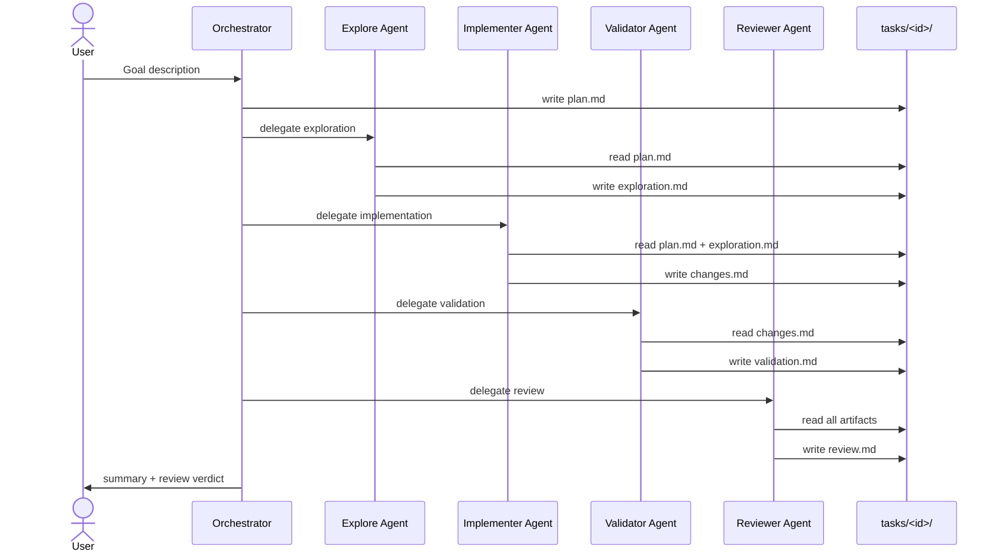

# System Architecture

## Overview

The CoPilot-MultiAgent system provides a five-phase AI pipeline that runs entirely inside VS Code with GitHub Copilot. Phases are executed by specialized custom agents; context flows forward through Markdown handoff artifacts stored under `tasks/<task-id>/`.

## Pipeline Sequence



## Agent Roles

| Agent | Phase | Tool Access | Output Artifact |
|-------|-------|-------------|-----------------|
| Orchestrator | Coordination | read, edit, search, agent, todo | `plan.md` |
| Explore | Exploration | read, search | `exploration.md` |
| Implementer | Implementation | read, edit, search, execute (formatters only) | `changes.md` |
| Validator | Validation | read, execute | `validation.md` |
| Reviewer | Review | read, search | `review.md` |
| Docs Writer | Documentation | read, edit, search | updated docs |

## Handoff Artifact Schema

All artifacts live under `tasks/<task-id>/`. Each file follows the schema defined in [`write-task-artifact`](../.github/skills/write-task-artifact/SKILL.md) and the rules in [`handoff-artifacts.instructions.md`](../.github/instructions/handoff-artifacts.instructions.md).

```
tasks/
  <task-id>/              e.g. 20260514-add-auth
    plan.md               Orchestrator writes: goal, work packages, constraints
    exploration.md        Explore writes: affected files, dependencies, risks
    changes.md            Implementer writes: what changed, why, diff summary
    validation.md         Validator writes: commands run, pass/fail, logs
    review.md             Reviewer writes: verdict, evidence, required fixes
```

## Gating Rules

1. Implementer **must not start** until `exploration.md` is present and non-empty.
2. Validator **must not start** until `changes.md` is present and non-empty.
3. Reviewer **must not start** until `validation.md` shows a passing build/test run.
4. If review verdict is `changes-requested`, Orchestrator re-runs Implementer with the review findings as additional input.

## Optional Specialist Agents

For domain-specific projects, specialist agents can be added alongside the generic ones:

- **Firmware Engineer** — vendor-neutral embedded C/C++ development for microcontroller-based systems, especially Cortex-M0+, M4, and M33 targets.
- **Protocol Specialist** — Wire-format changes, codec updates, backwards-compatibility analysis.

These are included in the repo as template examples under `.github/agents/`.

## Cross-Cutting Instructions

Instructions files automatically apply to relevant files or are loaded on-demand:

| File | Scope |
|------|-------|
| [`code-style.instructions.md`](../.github/instructions/code-style.instructions.md) | Source files per language glob |
| [`testing.instructions.md`](../.github/instructions/testing.instructions.md) | Test files, new logic |
| [`security-boundaries.instructions.md`](../.github/instructions/security-boundaries.instructions.md) | On-demand for security-sensitive changes |
| [`handoff-artifacts.instructions.md`](../.github/instructions/handoff-artifacts.instructions.md) | `tasks/**/*.md` |

## MCP Integration

External tools connect via Model Context Protocol servers configured in `.vscode/mcp.json` (copied from `.vscode/mcp.json.example`). Agents that need GitHub, filesystem, docs, or browser access declare the required MCP tool sets in their `tools` frontmatter.
